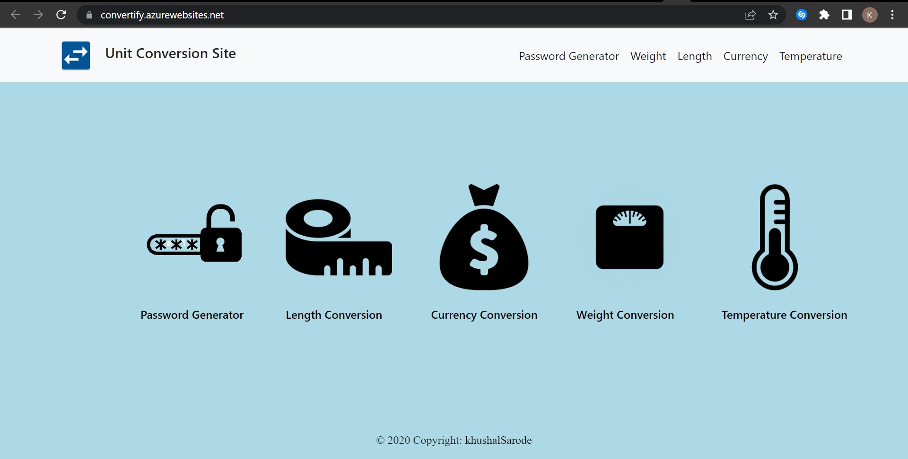
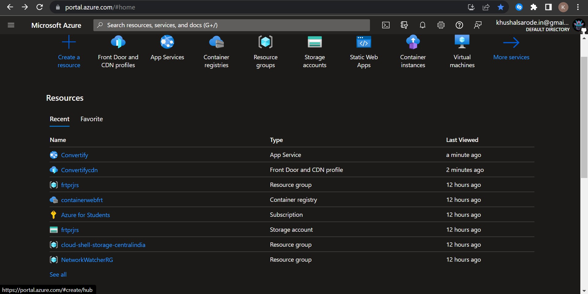

# Convertify

Convertify empowers you to convert units quickly and accurately.




## Description

Convertify is a web-based 2.0 application that provides units conversion and password generation functionalities. It allows users to convert between different units of length, weight, currency, and temperature. Additionally, it offers a password generator that creates passwords with various levels of complexity.

#Try Convertify
- Check out the live version of Convertify:[ Convertify Live Demo!](https://convertify.azurewebsites.net/)


## Units Conversion

1. Length Converter: Supports conversion between miles, yards (yd), kilometers (km), centimeters (cm), meters (m), inches (in), and feet (ft). The input is validated to ensure the length is not negative, and a prompt appears if a negative length is entered.

2. Weight Converter: Enables conversion between pounds, ounces, kilograms, grams, tons, stones, and milligrams. Similar to the length converter, negative weight inputs trigger a prompt indicating that weight cannot be negative.

3. Currency Converter: Utilizes an API to convert between different currencies. Users can select the source and target currencies, enter the amount to convert, and view the conversion result. Negative amounts are not allowed, and a prompt notifies the user if a negative value is entered.

4. Temperature Converter: Supports conversion between Fahrenheit (°F), Celsius (°C), and Kelvin (K). Fahrenheit and Celsius temperatures can be negative, but Kelvin represents an absolute temperature, so a prompt appears if a negative Kelvin value is entered.

## Password Generator

The password generator functionality allows users to generate passwords within a specified range of 8 to 64 characters. The generated passwords consist of a combination of alphabets, special characters, and numbers. The password strength is displayed in a paragraph tag on the screen, categorized as weak, medium, or strong.

## Interconnected Functionality

All the functionalities of Convertify are interconnected, allowing users to navigate between different conversion types. Clicking on the web app icon in the top-left corner returns users to the home page of the application, where they can choose their desired conversion or access the password generator.

## Technology Used

Convertify was developed using the following technologies:

- HTML
- CSS
- JavaScript
- Bootstrap

## Editor

The project was developed using Visual Studio Code as the code editor.

## Cloud Platform

Microsoft Azure was used as the cloud platform for hosting the Convertify application.

## Services
- Azure Container Registry (ACR)
- Webapp service
- Content Delivery Network

## Deployment

Follow these steps to deploy Convertify on Azure:

1. Clone the repository: [Convertify Repository]
```https://github.com/Khushalsarode/Convertify.git```

2. Create a container registry in Azure.

3. Build and tag the Docker image, and push it to the container registry.

   ```bash
   az acr build --image khushalsarode/webcontainerfrt:v1 --registry unitconverter --file Dockerfile .
   ```
   ``` az acr build --image <username>/<imagename>:tag --registry <acrname> --file <Dockerfile/pathtofile> .  ```

4. Create a web app service in Azure and connect it to the container in the container registry.

5. Scale the website as needed. Consider using a Content Delivery Network (CDN) to improve scalability.

## Project Execution Video
Watch the project execution video: [Project Execution Video](https://youtu.be/tTx8CqXneTQ)

## Integration and Deployment Video
Watch the integration and deployment video: [Integration and Deployment Video](https://youtu.be/FzlVxMUuh_U)

## Developed By
Convertify was developed by Khushalsarode. This project was part of the Microsoft Azure Virtual Internship.
